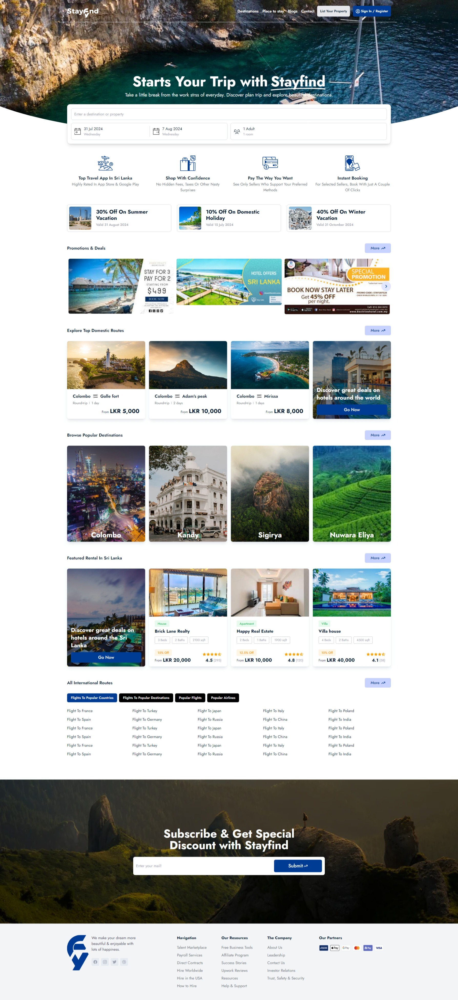
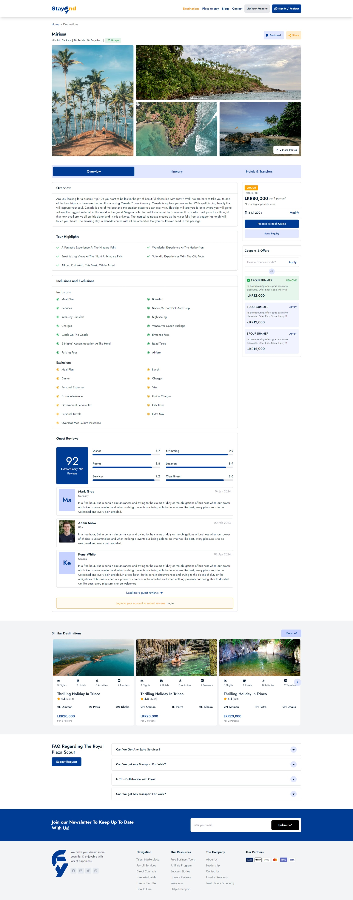
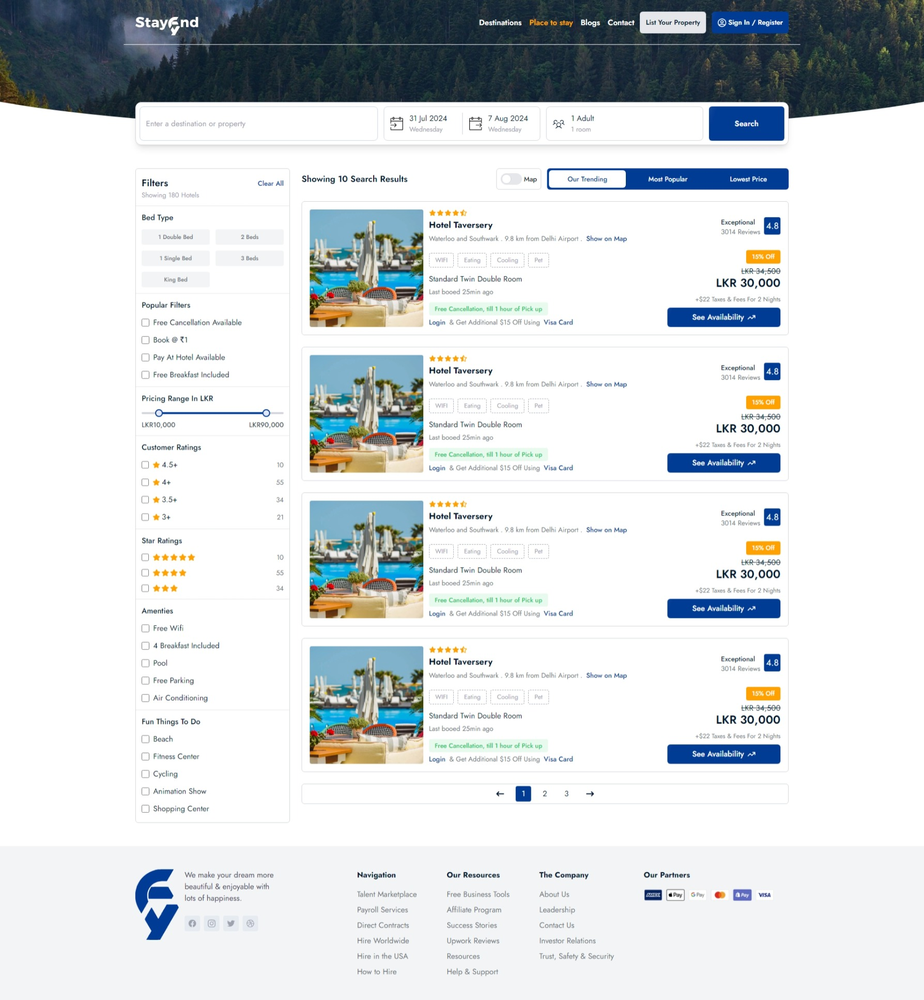
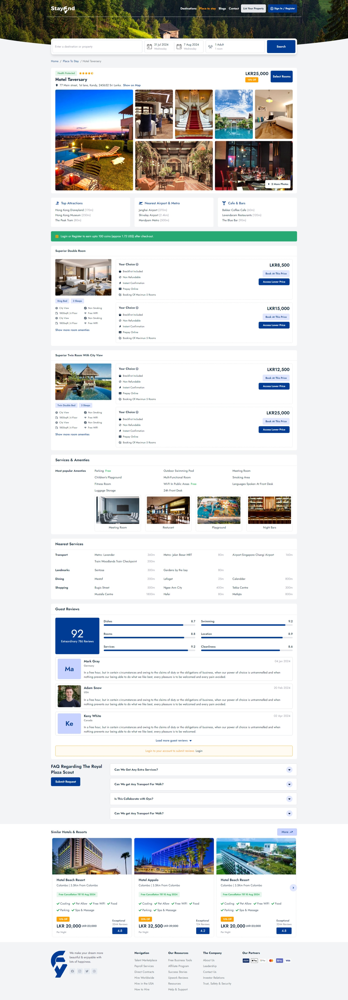
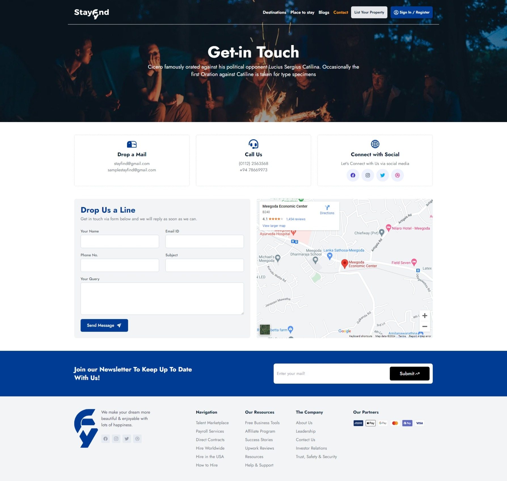

# StayFind Theme File

StayFind is a modern and responsive hotel and destination booking application theme. Built with React and Tailwind CSS, this project offers a sleek and intuitive user interface designed to enhance the user experience. This repository contains the theme file for a client project.

## Table of Contents
- [Features](#features)
- [Technologies Used](#technologies-used)
- [Installation](#installation)
- [Usage](#usage)
- [Screenshots](#screenshots)
  - [Home Page](#home-page)
  - [Destination Details](#destination-details)
  - [Hotels List](#hotels-list)
  - [Hotel Details](#hotel-details)
  - [Contact](#contact)
- [License](#license)
- [Contact](#contact)

## Features

- **Responsive Design**: Optimized for various devices, including desktops, tablets, and mobile phones.
- **Modern UI**: Clean and modern design elements using Tailwind CSS.
- **Interactive Elements**: Includes components like date pickers, carousels, and more for a dynamic user experience.
- **Customizable**: Easily customizable with Tailwind's utility-first CSS framework.

## Technologies Used

- **React**: A JavaScript library for building user interfaces.
- **Tailwind CSS**: A utility-first CSS framework for rapid UI development.

## Installation

To set up the project locally, follow these steps:

1. **Clone the repository**:

   ```bash
   git clone https://github.com/yourusername/StayFind.git
   ```

2. **Navigate to the project directory**:

   ```bash
   cd StayFind
   ```

3. **Install dependencies**:

   ```bash
   npm install
   ```

4. **Start the development server**:

   ```bash
   npm start
   ```

   The application should now be running on `http://localhost:3000`.

## Usage

This theme is designed for hotel and destination booking websites. Customize the components and styles as per the client's requirements. Refer to the Tailwind CSS documentation for further customization options.

## Screenshots

### Home Page

*The landing page showcasing featured destinations and hotels.*

### Destination Details

*Detailed information about destinations, including amenities and reviews.*

### Hotels List

*A list of available hotels for selected destinations, with filtering options.*

### Hotel Details

*Comprehensive details about a specific hotel, including room options and user reviews.*

### Contact

*The contact page where users can get in touch with support or make inquiries.*

## License

This project is licensed under the MIT License. See the [LICENSE](LICENSE) file for more details.

## Contact

For inquiries or support, please contact [yourname@example.com](mailto:prasadsachintha1231@gmail.com).
